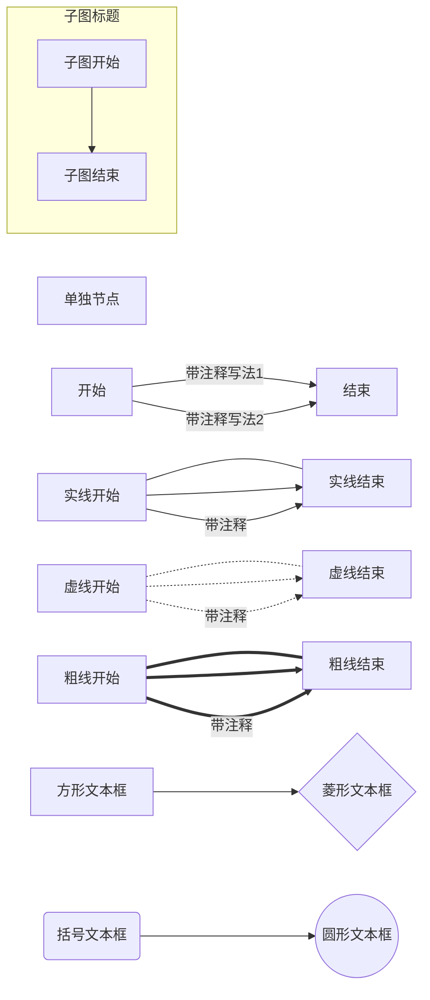

本文主要介绍 Mermaid 的语法，关于github博客如何支持 Mermaid 参考[这篇文章](/2017/11/09/mermaid-flow)


如果想要测试 Mermaid 语法的话，可以使用 Mermaid [在线编辑器](https://mermaidjs.github.io/mermaid-live-editor)


### 流程图

开头以 graph 声明，流程图的语法如下：

```tex
graph LR
  单独节点
  开始 -- 带注释写法1 --> 结束
  开始 -->|带注释写法2| 结束
  实线开始 --- 实线结束
  实线开始 --> 实线结束
  实线开始 -->|带注释| 实线结束
  虚线开始 -.- 虚线结束
  虚线开始 -.-> 虚线结束
  虚线开始 -.->|带注释| 虚线结束
  粗线开始 === 粗线结束
  粗线开始 ==> 粗线结束
  粗线开始 ==>|带注释| 粗线结束
  subgraph 子图标题
    子图开始 --> 子图结束
  end
  节点1[方形文本框] --> 节点2{菱形文本框}
  节点3(括号文本框) --> 节点4((圆形文本框))
  
```

显示效果如下图所示：




* 图的方向支持一下几种方式：

~~~tex
graph LR

TB - 从上到下(top buttom)
BT - 从下到上(buttom top)
LR - 从左到右(left right)
RL - 从右到左(right left)
TD - 跟 TB 相同
~~~


* 三种线类型

~~~text
--- : 实现
-.- : 虚线
=== : 粗线
~~~


* 虚线带箭头的话加 `>` ，实线和粗线则最后一个字符替换成 `>`


* 注释的两种写法(中间加注释，后边加注释)

~~~tex
  -- 中间加注释写法 -->
  -->|后边加注释写法|
~~~


* 文本框类型

~~~tex
[] - 方形文本框
{} - 菱形文本框
() - 边角圆滑文本框
(()) - 圆形文本框
~~~


* 子图

~~~tex
  subgraph 子图标题
    子图开始 --> 子图结束
  end
~~~


### 时序图

### 甘特图


### 其他

Mermaid 反意字符使用 `#hex; ` 表示。

