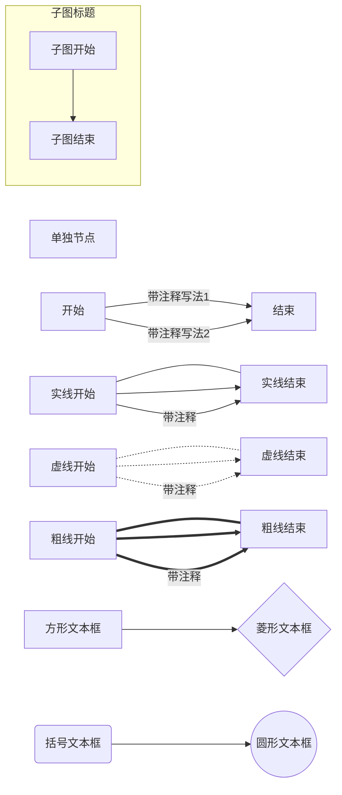

本文主要介绍 Mermaid 的语法，关于github博客如何支持 Mermaid 参考[这篇文章](/2017/11/09/mermaid-flow)


如果想要测试 Mermaid 语法的话，可以使用 Mermaid [在线编辑器](https://mermaidjs.github.io/mermaid-live-editor)


### 流程图

开头以 graph 声明，流程图的语法如下：

```tex
graph LR
  单独节点
  开始 -- 带注释写法1 --> 结束
  开始 -->|带注释写法2| 结束
  实线开始 --- 实线结束
  实线开始 --> 实线结束
  实线开始 -->|带注释| 实线结束
  虚线开始 -.- 虚线结束
  虚线开始 -.-> 虚线结束
  虚线开始 -.->|带注释| 虚线结束
  粗线开始 === 粗线结束
  粗线开始 ==> 粗线结束
  粗线开始 ==>|带注释| 粗线结束
  subgraph 子图标题
    子图开始 --> 子图结束
  end
  节点1[方形文本框] --> 节点2{菱形文本框}
  节点3(括号文本框) --> 节点4((圆形文本框))
  
```

显示效果如下图所示：




* 图的方向支持一下几种方式：

~~~tex
graph LR

TB - 从上到下(top buttom)
BT - 从下到上(buttom top)
LR - 从左到右(left right)
RL - 从右到左(right left)
TD - 跟 TB 相同
~~~


* 三种线类型

~~~text
--- : 实现
-.- : 虚线
=== : 粗线
~~~


* 虚线带箭头的话加 `>` ，实线和粗线则最后一个字符替换成 `>`


* 注释的两种写法(中间加注释，后边加注释)

~~~tex
  -- 中间加注释写法 -->
  -->|后边加注释写法|
~~~


* 文本框类型

~~~tex
[] - 方形文本框
{} - 菱形文本框
() - 边角圆滑文本框
(()) - 圆形文本框
~~~


* 子图

~~~tex
  subgraph 子图标题
    子图开始 --> 子图结束
  end
~~~


### 时序图

时序图以 `sequenceDiagram` 开头声明，语法如下所示

```tex
sequenceDiagram
    participant Alice
    participant John
    Alice ->> John:  实线带箭头: ->>
    John -->> Alice: 虚线带箭头: -->>
    Alice -> John : 实线不带箭头: ->
    activate John
    Note over Alice,John: 这个注释在两个人的上方
    John --> Alice : 虚线不带箭头: -->
    deactivate John
    Alice -x John : 实线结尾带X: -x
    John --x Alice : 虚线结尾带X: --x
```

显示效果如下：

~~~mermaid
sequenceDiagram
    participant Alice
    participant John
    Alice ->> John:  实线带箭头: ->>
    John -->> Alice: 虚线带箭头: -->>
    Alice -> John : 实线不带箭头: ->
    activate John
    Note over Alice,John: 这个注释在两个人的上方
    John --> Alice : 虚线不带箭头: -->
    deactivate John
    Alice -x John : 实线结尾带X: -x
    John --x Alice : 虚线结尾带X: --x
~~~


* 参与者（participant）

~~~tex
participant 名称1
participant 名称2
participant A as Alice  : 通过 as 定义别名，后续使用 A 比较方便
~~~

**注：声明的顺序与画图的顺序一致**


* 箭头类型（一个`>`不带箭头, 两个`>`带箭头; 一个`-`实线，两个`-`虚线）

|  类型  |   描述   |
| :--: | :----: |
|  ->  | 实线不带箭头 |
| -->  | 虚线不带箭头 |
| ->>  | 实线带箭头  |
| -->> | 虚线带箭头  |
|  -x  | 实线结尾带X |
| --x  | 虚线结尾带X |


* 激活参与者

```tex
activate John    : 激活参与者
deactivate John  : 去激活参与者

也可以通过在 > 后面使用 +/- 符号表示激活和去激活，例如：

Alice->>+John: Hello John, how are you?
```


* 注释

```tex
Note [ right of | left of | over ] [Actor]: Text in note content

注: Actor 可以是多个，通过逗号分割，例如：

Note over Alice,John: A typical interaction
```


* 循环序列

~~~tex
loop 描述文本
... 时序图语句 ...
end
~~~

例子

~~~tex
sequenceDiagram
    Alice->John: Hello John, how are you?
    loop Every minute
        John-->Alice: Great!
    end
~~~

显示效果

~~~mermaid
sequenceDiagram
    Alice->John: Hello John, how are you?
    loop Every minute
        John-->Alice: Great!
    end
~~~


* 条件时序

~~~tex
alt 描述文本
... statements ...
else
... statements ...
end
~~~

例子：

```tex
sequenceDiagram
    Alice->>Bob: Hello Bob, how are you?
    alt is sick
        Bob->>Alice: Not so good
    else is well
        Bob->>Alice: Feeling fresh like a daisy
    end
```

显示效果

~~~mermaid
sequenceDiagram
    Alice->>Bob: Hello Bob, how are you?
    alt is sick
        Bob->>Alice: Not so good :(
    else is well
        Bob->>Alice: Feeling fresh like a daisy
    end
~~~


* 可选时序

~~~text
opt 描述文本
... statements ...
end
~~~

例子

~~~text
sequenceDiagram
    Alice->>Bob: Hello Bob, how are you?
    opt Extra response
        Bob->>Alice: Fine,Thanks
    end
~~~

显示效果

~~~mermaid
sequenceDiagram
    Alice->>Bob: Hello Bob, how are you?
    opt Extra response
        Bob->>Alice: Fine,Thanks
    end
~~~


### 甘特图


### 其他

Mermaid 反意字符使用 `#hex; ` 表示。

